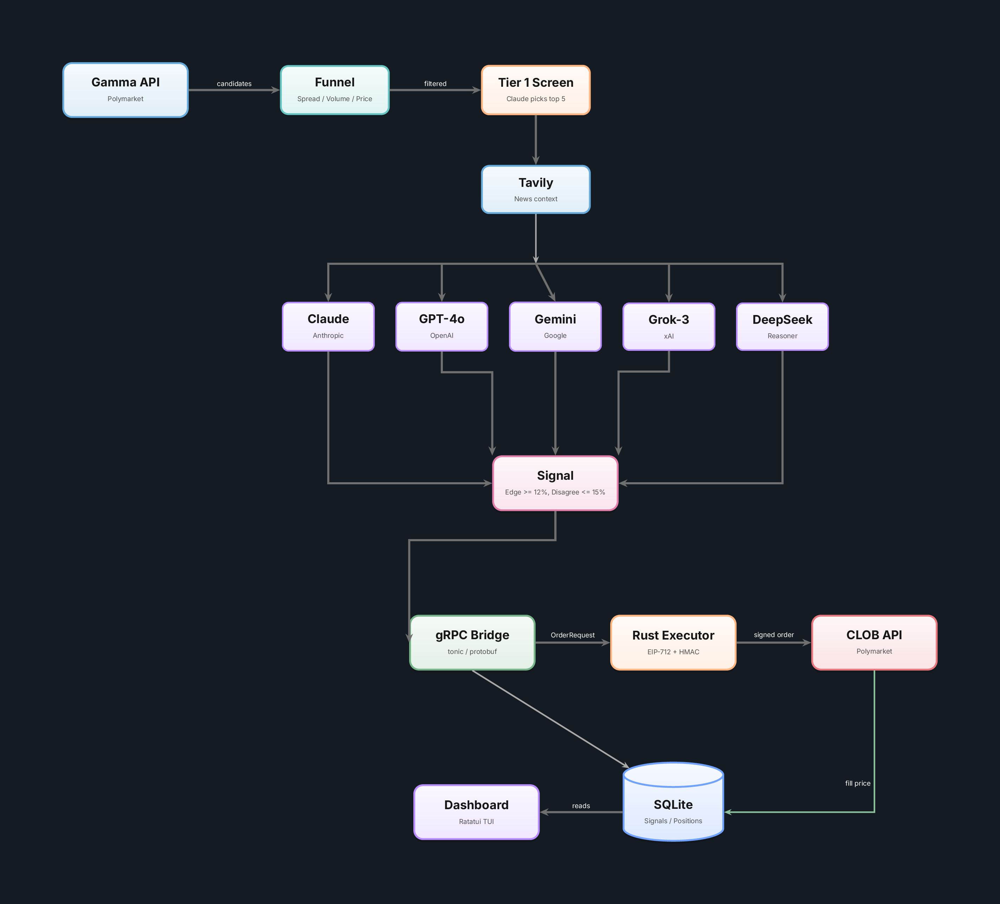

<!-- Badges -->


# signum

Autonomous prediction market trading on Polymarket. Uses multi-LLM consensus to find mispriced markets and executes orders through a Rust engine with EIP-712 signing.

**Paper trading: 6,841 signals logged, 65% win rate on resolved trades.**

## Why

Prediction markets price events as probabilities, but they're often wrong on politics and world events where LLMs have strong priors. This bot finds those mispricings automatically: five LLMs vote on what the true probability should be, and when they agree the market is off by 12%+, it trades.

## How It Works

1. **Every 6 hours**, the pipeline fetches live markets from Polymarket's Gamma API
2. **Funnel** filters to liquid, tradable candidates (spread < 3%, volume >= $5k, 5-95% price range)
3. **Tier 1 screen**: Claude picks the top 5 markets worth analyzing
4. **Tier 2 analysis**: 5 LLMs independently estimate the true probability, with fresh news context from Tavily
5. **Signal**: If consensus edge >= 12% and disagreement <= 15%, log a trade signal
6. **Execution**: Signal goes over gRPC to the Rust executor, which signs and submits to Polymarket's CLOB

See the [architecture diagram](#architecture) below for the full pipeline.

## LLM Consensus Engine

Five models vote independently on each market:

| Model | Provider |
|-------|----------|
| Claude Opus | Anthropic |
| GPT-4o | OpenAI |
| Gemini 2.5 Flash | Google |
| Grok-3 | xAI |
| DeepSeek Reasoner | DeepSeek |

The highest and lowest estimates are dropped. The middle three are averaged to produce the consensus probability. A signal fires when this consensus diverges from the market price by at least 12 percentage points, with less than 15% disagreement among models.

## Architecture



Python handles the slow layer (LLM analysis, market scanning). Rust handles the fast layer (order execution, cryptographic signing, WebSocket feeds). They talk over gRPC.

### Python Strategy Layer

| File | Purpose |
|------|---------|
| `funnel.py` | Fetch and filter market candidates from Gamma API |
| `strategies/llm.py` | Multi-LLM consensus analysis (Tier 1 screen + Tier 2 deep analysis) |
| `paper_trade.py` | CLI for paper trading: run pipeline, view reports, resolve signals |
| `client.py` | Polymarket CLOB client initialization |
| `whale_finder.py` | Whale wallet analysis (experimental, not integrated) |

### Rust Execution Layer

| File | Purpose |
|------|---------|
| `executor.rs` | EIP-712 order signing, HMAC-SHA256 L2 auth, tick size snapping, USDC math |
| `main.rs` | gRPC server on port 50051, heartbeat loop (5s keepalive) |
| `ws.rs` | WebSocket subscription (experimental) |

### gRPC Bridge

Defined in `proto/trader.proto`. Python sends an `OrderRequest` (market_id, outcome, price, size, tick_size, neg_risk) and gets back an `OrderResponse` (success, order_id, message).

## Stack

| Layer | Technology |
|-------|-----------|
| Market data | Polymarket Gamma API, py-clob-client |
| LLM analysis | Claude, GPT-4o, Gemini, Grok, DeepSeek |
| News context | Tavily search API |
| Order signing | EIP-712 via alloy-rs |
| L2 auth | HMAC-SHA256 (timestamp + method + path + body) |
| Order execution | Rust, reqwest, Polymarket CLOB REST API |
| gRPC bridge | tonic 0.12 (Rust) + protobuf stubs (Python) |
| Web dashboard | Next.js 16, Tailwind, Recharts, TradingView Lightweight Charts |
| Database | SQLite (signals, positions, portfolio snapshots) |
| Scheduling | Cron (every 6 hours) |

## Getting Started

### Prerequisites

- Python 3.13+
- Rust toolchain (cargo)
- A Polymarket account with API credentials
- API keys for: Anthropic, OpenAI, Google AI, xAI, DeepSeek, Tavily

### Setup

```bash
git clone https://github.com/danielbusnz-lgtm/signum
cd signum
```

**Python** (uses [uv](https://docs.astral.sh/uv/)):

```bash
uv sync
```

Or with pip:

```bash
python3 -m venv .venv
source .venv/bin/activate
pip install .
```

**Rust:**

```bash
cd rust
cargo build
```

**Web dashboard:**

```bash
cd web
pnpm install
```

Copy `.env.example` to `.env` and fill in your keys:

```bash
cp .env.example .env
```

You need API keys for Polymarket (wallet + API credentials), all five LLM providers (Anthropic, OpenAI, Google, xAI, DeepSeek), and Tavily for news context. See `.env.example` for the full list.

### Paper Trading

```bash
cd python

# Run the full pipeline once and log signals to SQLite
python3 paper_trade.py run

# View calibration report (win rate by edge bucket)
python3 paper_trade.py report

# Mark a signal as resolved
python3 paper_trade.py resolve <id> YES
```

### Live Execution

```bash
# Terminal 1: Start the Rust gRPC server
cd rust && cargo run

# Terminal 2: Run the Python pipeline (signals auto-submit over gRPC)
cd python && python3 paper_trade.py run
```

### Web Dashboard

```bash
# Terminal 1: Start the API server
cd python && uvicorn api:app --port 8888

# Terminal 2: Start the Next.js frontend
cd web && pnpm dev
```

Open `http://localhost:3000`. The dashboard shows an equity curve, open positions with live prices, KPI strip (win rate, Sharpe, drawdown), and an analytics page with calibration charts and model health.

For production, use Docker:

```bash
docker build -f Dockerfile.api -t signum-api .
docker build -f Dockerfile.web --build-arg NEXT_PUBLIC_API_URL=http://your-api:8888 -t signum-web .
```

### Cron Automation

```bash
# Run every 6 hours
0 */6 * * * cd /path/to/signum && bash run_paper_trade.sh >> logs/paper_trade.log 2>&1
```

## Project Structure

```
├── python/
│   ├── paper_trade.py           # Main CLI (run, report, resolve)
│   ├── funnel.py                # Market candidate filtering
│   ├── strategies/llm.py        # Multi-LLM consensus engine
│   ├── api.py                   # FastAPI backend for web dashboard
│   ├── client.py                # CLOB client init
│   ├── seed_mock_data.py        # Generate mock data for development
│   └── proto/                   # Generated gRPC stubs
├── rust/
│   ├── src/
│   │   ├── main.rs              # gRPC server + heartbeat
│   │   ├── executor.rs          # EIP-712 signing + order placement
│   │   └── ws.rs                # WebSocket (experimental)
│   ├── Cargo.toml
│   └── build.rs                 # Proto compilation
├── web/                         # Next.js 16 dashboard
│   ├── app/(dashboard)/         # Dashboard + analytics pages
│   ├── components/dashboard/    # Equity curve, positions, charts
│   └── lib/                     # API client, hooks, metrics
├── proto/trader.proto           # gRPC service definition
├── Dockerfile.api               # Python API container
├── Dockerfile.web               # Next.js container
├── run_paper_trade.sh           # Cron runner script
└── .env.example
```

## Disclaimer

Experimental software. Do not trade with money you cannot afford to lose.
